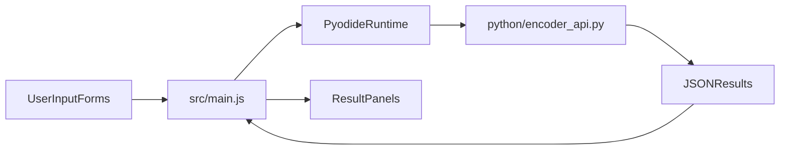

# Vite + Pyodide L↔Gödel App Plan

## Goal
Ship a local-first website where users can encode/decode L-language instructions and programs using the existing Python logic from [working.py](working.py), executed in-browser via Pyodide.

## What We’ll Reuse
- Keep the core math/parsing logic from [working.py](working.py): `encode_instruction`, `calc`, `L_lbl`, `L_var`, `L_ins`, and parse helpers.
- Remove CLI-only runtime behavior (the infinite menu loop) from browser execution path.

```107:121:working.py
# --- Main Infinite Loop ---
while True:
    print("\n=== Main Menu ===")
    print("1: Decode Full Program")
    print("2: Decode Exponent(s) (A,B,C,D)")
    print("3: Code Single Instruction")
    print("4: Code Full Program")
    print("5: Exit Program")
```

## Target Architecture


## Implementation Phases
1. **Stabilize frontend scaffold (Vite baseline)**
- Confirm `index.html`, `src/main.js`, and `src/style.css` exist after your Vite install.
- Keep a single-page layout with sections for:
  - Single instruction encode
  - Multi-line program encode
  - Exponent decode
  - Full Gödel number decode
- Add clear error/output panels (instead of console-only messages).

2. **Refactor Python for browser API**
- Create [src/python/encoder_api.py](src/python/encoder_api.py) (or equivalent) by extracting pure logic from [working.py](working.py).
- Expose deterministic functions (no `input()` / `print()` control flow):
  - `encode_instruction_line(line)`
  - `encode_program_lines(lines)`
  - `decode_exponent(value)`
  - `decode_program_number(x)`
- Return dict/list data structures that JS can render directly.
- Preserve current classroom semantics (including label/variable encoding rules).

3. **Integrate Pyodide in Vite frontend**
- In [src/main.js](src/main.js), load Pyodide once at app startup.
- Load `encoder_api.py` into the runtime and cache callable wrappers.
- On each UI action, pass form data to Python, parse JSON output, and render results.
- Add “loading runtime…” and “busy” states to avoid confusing first-load delay.

4. **GitHub Pages deployment setup**
- Configure Vite `base` for project-page hosting (typically `/<repo-name>/`) so built assets resolve correctly on Pages.
- Confirm Pyodide assets are loaded from a Pages-safe path (CDN or `public/` static files) and avoid absolute local paths.
- Add a GitHub Actions workflow at `.github/workflows/deploy.yml` to build with Node + pnpm and deploy `dist/` to GitHub Pages on push to `main`.
- Enable repository Pages source as **GitHub Actions** and document required permissions (`pages: write`, `id-token: write` in workflow).
- Ensure SPA fallback expectations are clear; since this app is single-page and form-driven, avoid route-dependent behavior.

5. **UX and guardrails**
- Add input validation in JS before calling Python (empty lines, invalid ints, malformed instruction text).
- Set practical limits/messages for very large numbers to avoid browser lockups.
- Show optional “math work” sections as collapsible details (mirrors current CLI educational output).

6. **Verification + parity checks**
- Create a small set of known examples from [working.py](working.py) behavior and verify browser output matches:
  - `Y<-Y+1`
  - `[A] X1<-X1-1`
  - `IF Z2=/=0 GOTO [B1]`
  - Multi-line encode/decode round-trip cases
- Smoke test in Vite dev server and production build.
- Validate deployed Pages URL with hard refresh and direct access checks for static assets.

## Notes/Risks to handle early
- Full Gödel numbers can grow huge quickly; prefer showing prime-factor form (`p^e * ...`) as primary output.
- `decode_program_number(x)` can be expensive for large `x` with naive factorization; include guardrails and user messaging.
- Keep Python module import-safe (no auto-running menu loop in browser context).

## Deliverables
- Browser UI running on Vite dev server.
- Pyodide-backed encode/decode features functioning end-to-end.
- Core logic isolated in reusable Python API module.
- Basic test vectors documented for regression checks.
- GitHub Actions Pages auto-deploy configured, documented, and live URL verified.